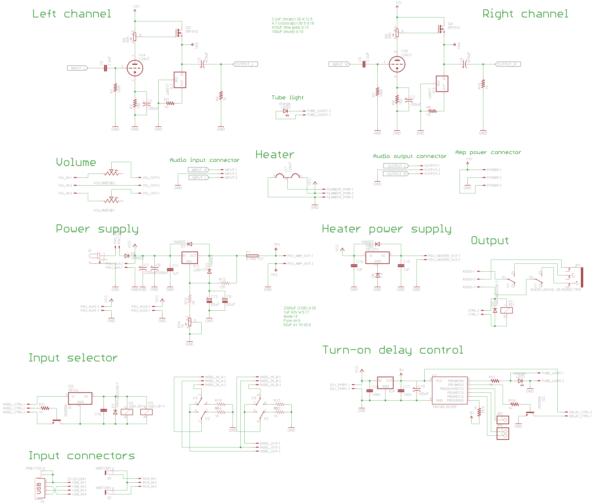
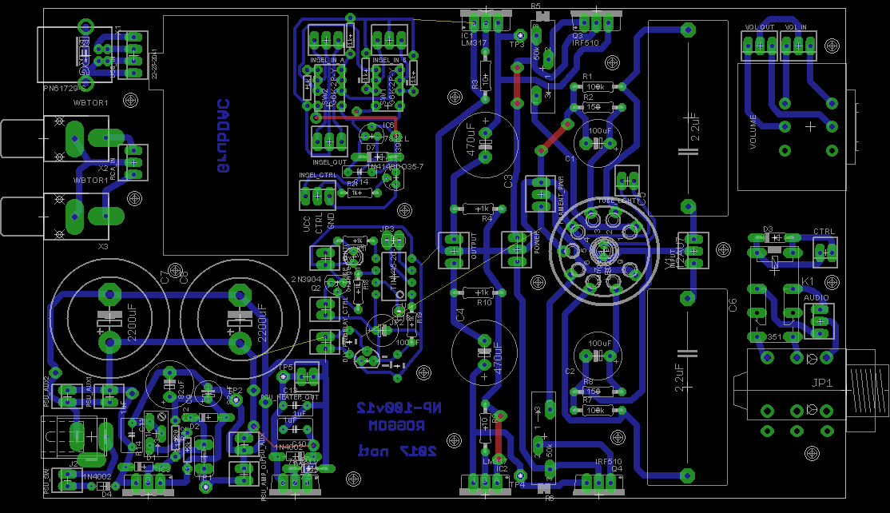

# NP-100v12
My take on the [NP-100v12](http://diyaudioprojects.com/Solid/12AU7-IRF510-LM317-Headamp/) headphone amp (also it has a [GrubDac](http://www.diyforums.org/GrubDAC/GrubDACoverview.php) built in)

